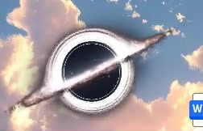

# Black Hole Recycle Bin

一个以 Gargantua 黑洞为灵感的 Windows 桌面回收站。它使用 Electron 与 WebGL 呈现倾斜吸积盘、引力透镜、旋转光环与粒子流，并把拖入的文件送入 Windows 系统回收站。
## 黑洞回收站
## 效果演示

<video controls muted playsinline poster="./assets/black-hole-recycle-bin-demo.jpg">
  <source src="./assets/black-hole-recycle-bin-demo.mp4" type="video/mp4">
  Your browser does not support embedded video.
</video>

[](./assets/black-hole-recycle-bin-demo.mp4)

## 下载与使用

从本仓库的 [Releases](../../releases) 下载 `BlackHole-RecycleBin-Portable.exe`，双击即可运行。

便携版首次启动时会自动释放运行组件到当前用户的本地应用缓存目录；分发时只需要发送这一个 EXE 文件。

## 交互

- 黑洞固定在桌面右下角，可拖动调整位置。
- 将文件拖向黑洞时，图标会进入引力感应、捕获、螺旋下落与吞噬完成四个阶段。
- 文件真正进入 Windows 系统回收站，不会绕过系统的还原机制。

## 本地开发

```powershell
npm install
npm run start
```

## 技术

- Electron 43
- WebGL / Canvas
- `requestAnimationFrame` 动画状态机
- Windows Shell 回收站接口

## 说明

便携版目前未进行代码签名，因此部分 Windows 设备首次运行时可能显示 SmartScreen 提示。
